# aasvg

[](https://crates.io/crates/aasvg)
[](https://docs.rs/aasvg)
[](LICENSE)

A Rust port of [aasvg](https://github.com/martinthomson/aasvg), which converts ASCII art diagrams into SVG.

<!-- Generated with: cargo run -p aasvg-cli -- example.txt -o example.svg -->


## CLI Usage

```sh
cargo install aasvg-cli

# Convert a file
aasvg input.txt -o output.svg

# Or use stdin/stdout
cat input.txt | aasvg > output.svg
```

## Library Usage

```rust
use aasvg::render;

let diagram = r#"
    +-----+     +-----+
    |     |---->|     |
    +-----+     +-----+
"#;

let svg = render(diagram);
```

The output SVG automatically supports light and dark mode via CSS `prefers-color-scheme`.

## Attribution

This project is a Rust port of Martin Thomson's [aasvg](https://github.com/martinthomson/aasvg), which itself uses the diagram rendering code from Morgan McGuire's [Markdeep](https://casual-effects.com/markdeep/).

Related projects:
- [goat](https://github.com/blampe/goat) - A Go implementation that reimplements the Markdeep algorithm

## License

BSD-2-Clause, matching the original aasvg license.
